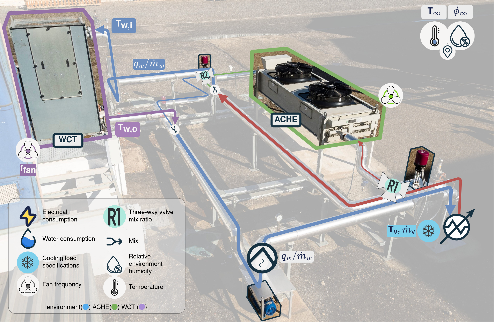
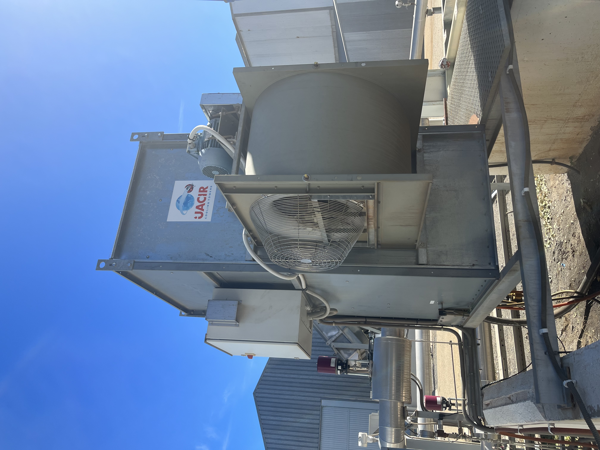
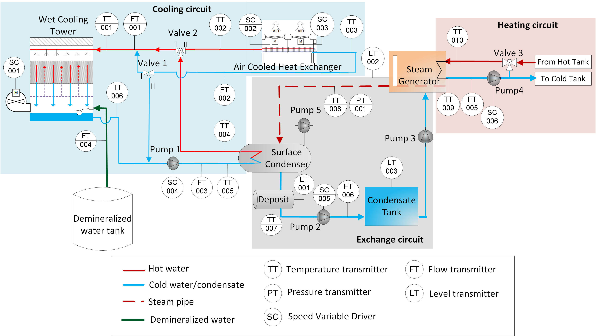

# Repository for a Combined Cooling pilot plant experimental datasets



Repository that contains experimental data obtained from a Wet Cooling Tower (WCT) plant located at [Plataforma Solar de Almería](https://www.psa.es/es/index.php) (PSA).

## Context

For the article "Wet cooling tower performance prediction in CSP plants: A comparison between artificial neural networks and Poppe’s model", three experimental campaigns were used, quoting from the article:

> A total of 132 steady-state experimental points have been obtained thanks to the thorough experimentation conducted. These data cover a large variety of ambient conditions (different seasons, days and nights) and thermal loads (from 27 kW to 207 kW).  

The data spans from 2019-10-15 to 2023-10-18

## Nomenclature and variables description

Nomenclature format: 

- Name in article - `Name in dataset` - Units in dataset - Description

Nomenclature:

- $T_\infty$ - `Tamb` - °C - Ambient temperature
- $\phi_\infty$ - `HR` - % - Relative humidity
- $T_{in}$ / $T_{w,i}$ - `Tin` - °C - Inlet cooling water temperature
- $T_{out}$ / $T_{w,o}$ - `Tout` - °C - Outlet cooling water temperature
- $q_w$ / $q$ - `q` - m³/h - Cooling water flow rate
- $f_{fan}$ - `w_fan` - % - Fan feed frequency percentage
- $q_{w,lost}$ - `q_w_lost` - l/h - Water consumed by the cooling tower


## Description of the pilot plant

Tower type: Jacir S-1209-A-40-Nue



The pilot plant of combined cooling systems located at PSA  (see the layout in Figure 3) consists of three circuits: cooling, exchange and heating. In the cooling circuit, water circulating inside the tube bundle of a Surface Condenser (SC) can be cooled through a Wet Cooling Tower and/or a Dry Cooling Tower (type Air Cooled Heat Exchanger, ACHE), both with a designed thermal power of 204 kW$_{th}$. In the exchange circuit, a saturated steam generator of 80 kW$_{th}$ (on the design point), generates steam at different pressures (in the range between 82 mbar and 200 mbar), which is in turn condensed in the surface condenser. In this way, the steam transfers its latent heat of condensation to the refrigeration water, that is heated. Finally, in the heating circuit, a solar field with a thermal power of 300 kW$_{th}$ at the design point, provides the energy required by the steam generator, in the form of hot water. It is a unique, very flexible, fully instrumented and versatile facility, able to operate in different operation modes: series and parallel mode, conventional dry-only mode (all water flow is cooled through the dry cooling tower) and wet-only mode (all water flow is cooled through the wet cooling tower). The instrumentation related to the WCT is described in Table \ref{Table:instr}. Note that the sensors measuring the air velocity and temperature and relative humidity at the outlet area of the wet cooling tower have not been installed in the plant. Portable sensors were used instead in some experiments.

## Normative framework

The normative framework followed to carry out the experiments, in order to ensure stable conditions, has been the standards UNE 13741, titled _Thermal Performance Acceptance Testing of Mechanical Draught Series Wet Cooling Towers_, and CTI's _Acceptance Test Code for Water Cooling Towers_. These standards specify the test duration and the allowed variations of the most representative ambient and operating magnitudes (water flow rate, heat load, cooling tower range, wet-bulb and dry-bulb temperatures and wind velocity) during the tests. Although the duration of the test should not be less than one hour according to the standards, due to the low capacity of the WCT in the PSA pilot plant and the operational experience, the duration of the tests has been reduced to up to 30 minutes. Once stable conditions are maintained during the defined interval time, the average and deviations values of each measurement are calculated in order to check that they are within the allowable limits of the norm, which finally lead to a valid steady-state operating point. 

## Instrumentation



Characteristics of instrumentation ($^a$ value of the temperature in $^\circ$C, $^b$ of reading, $^c$ full scale, $^d$ mean value)

| Measured variable                            | Instrument           | Range                  | Measurement uncertainty                      |
|----------------------------------------------|----------------------|------------------------|----------------------------------------------|
| Water temperature (TT-001, TT-006)           | Pt100                | 0 -- 100 °C             | 0.03 + 0.005·T^a                             |
| Cooling water flow rate (FT-001)             | Vortex flow meter    | 9.8 -- 25 m³/h          | ± 0.65 % o.r.^b                              |
| Water flow rate (FT-004)                     | Paddle wheel         | 0.05 -- 2 m³/h          | ± 0.5 % of F.S^c + 2.5 % o.r                 |
| Ambient temperature                          | Pt1000               | -40 -- 60 °C            | ± 0.4 @20 °C                                 |
| Relative humidity                            | Capacitive sensor    | 0 -- 98%                | ± 3 % o.r @20 °C                             |
| Air velocity                                 | Impeller anemometer  | 0.1 -- 15 m/s             | ± 0.1 m/s + 1.5 % o.r                        |
| Outlet air temperature                       | Pt100                | -20 -- 70 °C              | ± 0.5 °C                                     |
| Outlet air humidity                          | Capacitive sensor    | 0 -- 100%                 | ± 2%                                         |


## Experimental campaigns

### Experimental campaign 1 - Exp 1

19 experimental tests were performed at the combined cooling pilot plant at PSA. The experimental campaign has been designed to cover different water-to-air mass flow ratios. 

Both variables, the water and the air flow rates, were varied within the allowable range for plant operation. In the case of the water flow rate, it ranged from 8 m$^3$/h to 22 m$^3$/h, and in the case of the air mass flow rate, it was modified by changing the fan frequency from 12.5~Hz to  50~Hz (fan frequency percentage, $f_{fan}$, from 25~\% to 100~\%). The magnitudes required to experimentally determine the air mass flow rate (air velocity and air temperature and relative humidity) were measured at the outlet area of the cooling tower with the sensors listed in Table \ref{Table:instr}. The outlet area was divided into 9 quadrants and the above mentioned magnitudes were registered at the center of each quadrant. The obtained values were averaged to determine the mean velocity, temperature and relative humidity used in the air mass flow rate calculation. 

As the measurements for the air mass flow rate are a specific requirement for the Poppe model, the $\dot{m}_a-f_{fan}$ relationship shown in Eq. \eqref{eq:maffan} was also derived during this experimental campaign. Following the same experimental procedure described earlier, air velocity, temperature and humidity maps were measured for 8 different $f_{fan}$ levels (ranging from 30~\% to 100~\% in 10~\% intervals). This correlation enables the calculation of the air mass flow rate using the permanent sensors installed in the facility.

$$
\dot{m}_a=-0.0014 f_{fan}^2+0.1743f_{fan}-0.7251.
$$

### Experimental campaign 2 - Exp 2

A set of 115 stationary data covering the following operating ranges: ambient temperature, $T_\infty$, \mbox{[9-39] $^{\circ}$C}, ambient humidity, $\phi_\infty$, [10-87] \%, inlet water temperature, $T_{w,i}$ [33-41] $^\circ$C, cooling water flow rate, $q_w$, [6-23] $m^3/h$ and fan frequency percentage, $f_{fan}$ [21-94]~\%. The thermal load in these tests varies in the range of [27-178]~${kW}_{th}$.

### Experimental campaign 3 - Exp 3

Set of 17 tests (different from the ones taken for experimental campaigns 1 and 2) has been used. This experimental campaign was designed using a design of experiments based on full factorial design with 4 factors and 2 levels (low and high), whose values are:

| Variable                   | Low level | High level |
|----------------------------|:-----------:|:------------:|
| $T_{b}$ (°C)             | ≤ 10      | ≥ 15       |
| $T_{w,i}$ (°C)           | ≤ 37      | ≥ 39       |
| $\dot{m}_w$ (kg/s)       | ≤ 3.3     | ≥ 5        |
| $T_{w,i}-T_{w,o}$ (°C)   | ≤ 7       | ≥ 8        |


An additional test at design operating conditions of the WCT ($T_{b,\infty}$=21 $^{\circ}$C, $T_{w,i}$=40 $^{\circ}$C, $\dot{m}_w$=6.9 kg/s and $T_{w,i}-T_{w,o}$=7 $^{\circ}$C) has been also included in this test campaign, where $T_{b,\infty}$ is the ambient wet bulb temperature and $T_{w,o}$ the temperature of the water at the outlet of the WCT.

## Data format

(Source [unidata](https://www.unidata.ucar.edu/software/netcdf/))

NetCDF (Network Common Data Form) is a set of software libraries and machine-independent data formats that support the creation, access, and sharing of array-oriented scientific data. It is also a community standard for sharing scientific data. The Unidata Program Center supports and maintains netCDF programming interfaces for C, C++, Java, and Fortran. Programming interfaces are also available for Python, IDL, MATLAB, R, Ruby, and Perl.

Data in netCDF format is:

- Self-Describing. A netCDF file includes information about the data it contains.
- Portable. A netCDF file can be accessed by computers with different ways of storing integers, characters, and floating-point numbers.
- Scalable. Small subsets of large datasets in various formats may be accessed efficiently through netCDF interfaces, even from remote servers.
- Appendable. Data may be appended to a properly structured netCDF file without copying the dataset or redefining its structure.
- Sharable. One writer and multiple readers may simultaneously access the same netCDF file.
- Archivable. Access to all earlier forms of netCDF data will be supported by current and future versions of the software.

## File structure

The datasets are located in the `data` folder:

- `Exp1.nc`. Dataset containing operation points for _Exp1_.
- `Exp2.nc`. Dataset containing operation points for _Exp2_.
- `Exp3.nc`. Dataset containing operation points for _Exp3_.
- `Complete.nc`. Dataset containing operation points for all experimental campaigns.

## How to use the data

Check this [FAQ](https://docs.unidata.ucar.edu/netcdf-c/current/faq.html#ncFAQGeneral). Also, specifically for the Python programming language there are several [examples](https://github.com/Unidata/netcdf4-python/tree/master/examples) available.

A code snippet is provided below to quickly convert the files to `csv` using a python environment with the packages from `requirements.txt`:

1. Install the dependencies
```bash
pip install -r requirements.txt
``` 

2. In a python interpreter, run the following code:

```python
from netCDF4 import Dataset
import pandas as pd
from pathlib import Path

# Path to where the data folder is located
data_path: Path = Path("data")

# Read netCDF files, create dataframes and export to csv
for file in data_path.glob("*.nc"):
    rootgrp = Dataset(file, "r")
    df = pd.DataFrame({varname: rootgrp.variables[varname][:] for varname in rootgrp.variables})
    rootgrp.close()
    
    # Export to csv
    df.to_csv(data_path / f"{file.stem}.csv", index=False)
    
    print(f"Exported {file.stem}.csv")
```

## Additional information

As mentioned, this experimental data is associated with this [open-access article](10.1016/j.energy.2024.131844), source code that allows to reproduce the results presented in the article can be found in [this repository](doi). 


# License

[CC BY 4.0. Attribution 4.0 International](https://creativecommons.org/licenses/by/4.0/)
